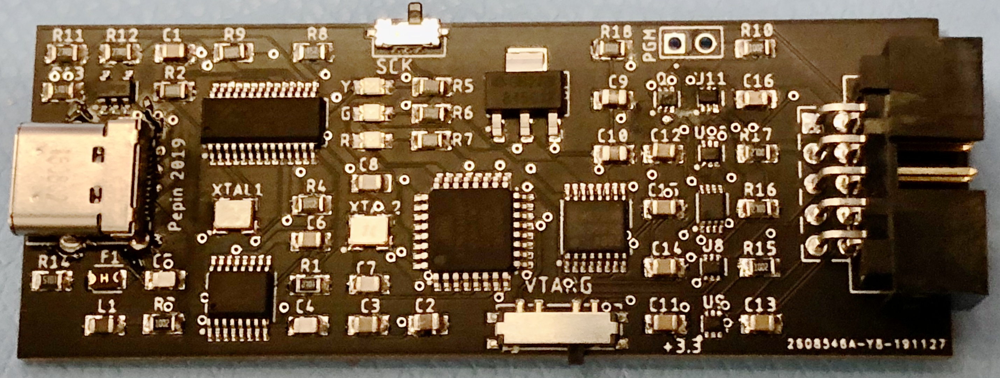

# AVR Programmer
Eagle files and gerbers for a programmer designed for Microchip's series of AVR microcontrollers.

## Overview
Microchip's series of AVR chips are simple 8 bit microcontrollers often used in Arduino boards. This programmer board can be used to program fuses and flash for bare AVR chips.

## Features

* Compatible with USBASP firmware and features, including slow clock.
* Selectable target voltage of 3.3v, 5v, or target provided (1.8v - 5.5v).
* Built-in serial to USB converter.
* Board can remain connected to target after programming.
* USB-C interface to PC with full ESD and overload protection.

## Design

This board is based on the hardware design for [USBASP](https://www.fischl.de/usbasp/) and is 100% compatible wth the USBASP firmware. I designed it to support different target voltages (namely 3.3v) and wanted built-in serial IO so I could connect a single connector to boards I design.

The board shows up as two USB devices: a FTDI serial port and a USBASP programmer.  There is an on-board USB hub that exposes both devices.  Target voltage is selectable through the VTARG switch and has three values:

1. 5V (left): Provide 5 volts as power and logic levels to the target board.
1. Float (middle): Adapt to whatever voltage the target board is using.
1. 3.3V (right): Provide 3.3 volts as power and logic levels to the target board.

If your board provides voltage of its own make sure you keep VTARG in the middle position.

The different voltage levels are shifted through an array of level shifters.  This circuit will change direction of the signals if PGM is bridged, which allows for initial programming of the board. All connections other than TXD and RXD also go to a high-impedance state whenever the red programming light is off (I reuse that signal line so I don't need any modifications to the USBASP firmware). Signal direction and tri-state is controlled by discrete logic, again so no USBASP mods are needed.  The level shifters I'm using go to high-impedance state when VCCA or VCCB is grounded.  This is handled by a push-pull pair of mosfets driven by discrete logic.

## Programming

Once the board is complete it must be flashed with the USBASP code. You need another working programmer for this.

1. Bridge the PGM pins on the board and set VTARG to either 5v or 3.3v depending on the output voltage of your existing programmer.
1. Connect your existing programmer's connector to the board.
1. Set your programmer to use a slow clock.
1. Run 'make Makefile88 fuses' from the USBASP project.
1. You can now turn off the slow clock feature of your programmer.
1. Run 'make Makefile88" to flash the firmware.

If successful, a green LED should be lit on the board. This LED is controlled by the USBASP firmware so it's a good indicator everything's working.  Remove the bridge to PGM and you should be good to go.
